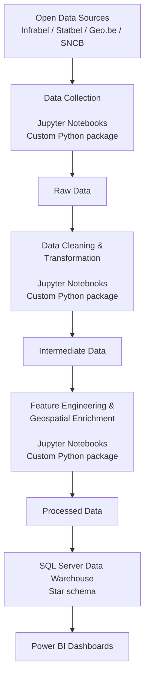
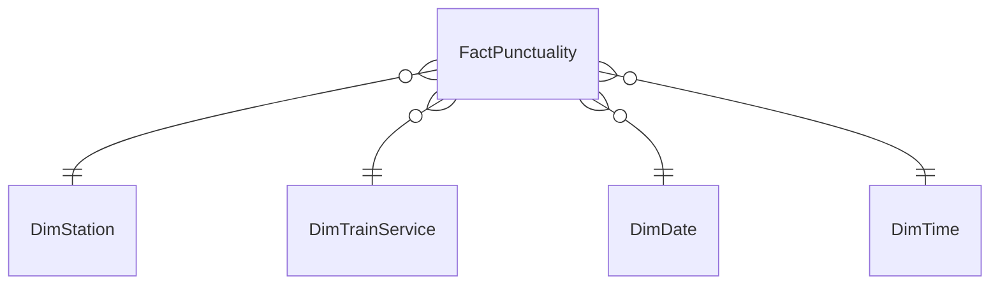

# Infrabel Railway Punctuality Analysis

> Investigating the gap between Infrabel's official punctuality statistics and public perception, 
> through alternative weighted metrics and granular analysis by station and train service, 
> built on a structured data pipeline and a star-schema data warehouse.

---

## Overview

This project evaluates the accuracy of official punctuality metric across the Belgian railway network using Infrabel's open data.
It covers the 2024-2025 period and processes ~45 million rows of raw punctuality data.

Infrabel publishes monthly or yearly national punctuality rates consistently around 90% (i.e. monthly on-time rates ranging from 84% to 94% across 2024-2025). 
This project stems from the observation that a **gap** exists **between Infrabel's aggregate national figures and public perception of railway punctuality**, investigated through two hypotheses:

- **Hypothesis 1 — Network disparity:** Punctuality varies significantly across train services and among stations. A regular passenger on a heavily delayed route, or one whose local station has a poor punctuality record, will have a fundamentally different experience from the national average.

- **Hypothesis 2 — Passenger weighting:** Trains tend to run more punctually on weekends and during off-peak hours, when passenger volumes are lower. Conversely, delays are more frequent on weekdays and during peak hours - precisely when the largest share of passengers is affected. Delays at lightly used stations carry the same weight as delays at major network hubs, such as Bruxelles-Central or Antwerp-Centraal. As a result, Infrabel's aggregate monthly or yearly figures may mask the experience of the majority of passengers.

To test these hypotheses, the project builds a **SQL Server star schema data warehouse** and proposes an **alternative metric**:

- **Passenger Metric (≥5 Minutes Late)** — A train is considered late if it arrives more than 
**5 minutes** after its scheduled arrival time (vs. 6 minutes in the official Infrabel measure).
Then, its delay is **weighted by average passenger volume** per station, sourced from SNCB ridership data.

Results are analyzed by station, train service, day of week, and time of day, and visualized in **Power BI dashboards with geospatial layers**.

---

## Project Status

🚧 **Originally developed as a data analyst training capstone project, this project is being refactored to meet professional data standards.**

| Phase | Status |
|---|---|
| Data collection (ingestion notebooks) | ✅ Complete |
| Data profiling and cleaning | ✅ Complete |
| Dimensions and fact table building | ✅ Complete |
| `infrabel_punctuality` package | ✅ Complete |
| SQL Server loading | ✅ Complete |
| Data warehouse building | ✅ Complete |
| Power BI dashboards | 🔄 In Progress |

---

## Getting Started

> ⚠️ **WARNING: Before cloning this repository, please read the following.**
>
> - **Disk space:** This repository requires approximately **45 GB** of disk space 
>   (raw data, silver and gold layers, and the SQL Server data warehouse).
>
> - **Execution time:** Running all notebooks end-to-end takes several hours
>   on a standard machine (16 GB RAM, SSD). The first ingestion notebook alone
>   takes approximately **45 minutes**. 
>
> - **SQL processing:** Derived column calculations (alternative punctuality
>   metric), constraint creation, and other DML scripts in SQL Server add approximately 
>   **1 to 2 hours** of processing time. 

### Prerequisites

- Python 3.12
- SQL Server 

### Installation

To install the local data pipeline package, run:

```bash
pip install -e .
```

The ingestion scripts are intended to be run manually and are not scheduled.

The new weighted metrics are computed in SQL rather than Python to avoid memory errors on the ~45-million-row fact table.

Optional:
Set SQL_SERVER if your SQL Server instance is not accessible through localhost.

---

## Tech Stack

| Layer | Tools |
|---|---|
| Data Collection & Transformation | Python · pandas · GeoPandas · SQLAlchemy · camelot |
| Orchestration | Jupyter Notebooks · custom `infrabel_punctuality` package |
| Data Warehouse | SQL Server · T-SQL · star schema |
| Visualization | Power BI · DAX · geospatial maps |
| Environment | VSCode · JupyterLab · Git/GitHub · Windows 11 |

---

## Data Sources

| Source | Dataset | Role |
|---|---|---|
| Infrabel Open Data | `punctuality_raw_MMyyyy` (24 files) | Builds `Fact_Punctuality` (~45 million rows) and `Dim_Train_Service` |
| Infrabel Open Data | `operational_pts_railway` | Builds `Dim_Station` |
| Statbel | `municipalities` | Enriches `Dim_Station` |
| Statbel | `population` | Enriches `Dim_Station` |
| geo.be | `territorialdivisions_3812.gpkg` | Geospatial layer for the spatial join between `operational_pts_railway` and `municipalities` in order to create `Dim_Station`  |
| SNCB | Passenger count PDF (October 2024) | Enriches `Fact_Punctuality` |

**Data Availability: The raw datasets are not included in this repository due to size constraints.**
However, the **SNCB passenger count PDF** is explicitly included to ensure project reproducibility, as its original commercial URL is subject to change and lacks the stability of an official Open Data portal.

---

## Project Architecture



---

## Notebooks

| # | Notebook | Status |
|---|---|---|
| 01-01 | *Data Collection - Infrabel* | ✅ |
| 01-02 | *Data Collection - Statbel and Geo.be* | ✅ |
| 01-03 | *Data Collection - SNCB* | ✅ |
| 02-01 | *Profiling and Cleaning - Stations* | ✅ |
| 02-02 | *Profiling and Cleaning - Municipalities* | ✅ |
| 02-03 | *Profiling and Cleaning - Geodata* | ✅ |
| 02-04 | *Profiling and Cleaning - Punctuality* | ✅ |
| 02-05 | *Handling Missing Values in the RELATION_DIRECTION column - Punctuality* | ✅ |
| 02-06 | *Profiling and Enrichment - SNCB Passengers* | ✅ |
| 02-07 | *Profiling and Cleaning - Population* | ✅ |
| 02-08 | *Profiling and Cleaning - Benchmark* | ✅ |
| 03-01 | *Building Dimension - Station* | ✅ |
| 03-02 | *Building Dimension - Train Service* | ✅ |
| 03-03 | *Building Fact Table - Punctuality* | ✅ |
| 04-01 | *Loading Dimensions to SQL Server* | ✅ |
| 04-02 | *Loading Fact Table to SQL Server* | ✅ |
| 04-03 | *Loading Benchmark to SQL Server* | ✅ |

---

## Star-schema Data Warehouse




